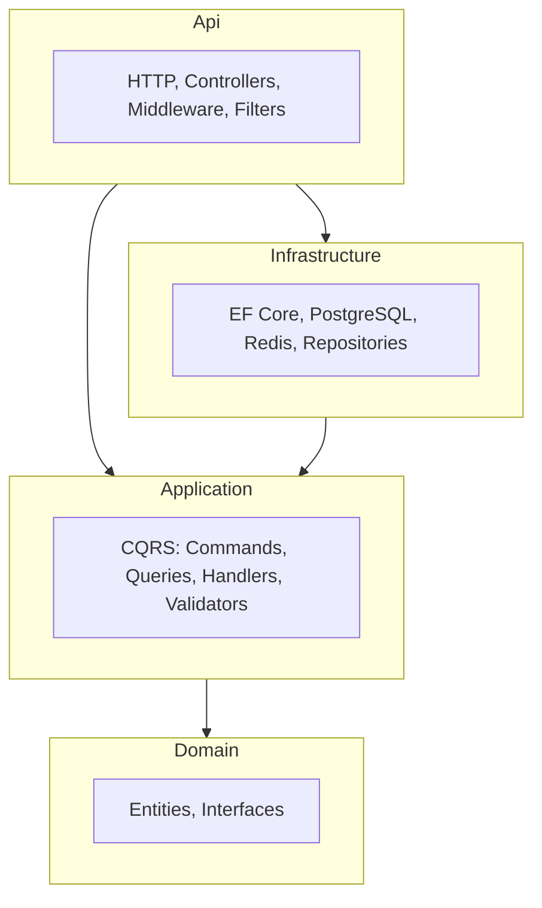
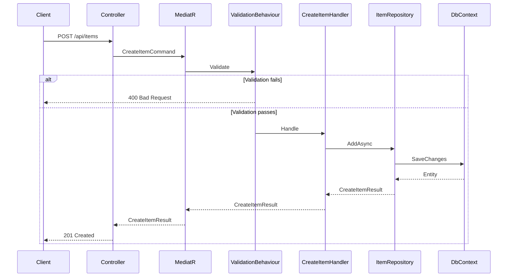

# Architecture overview

This document gives a short overview of the Clean Architecture layout and how the pieces fit together.

## Layers

- **Domain** — Entities (e.g. `Item`, `BaseEntity`) and abstractions (e.g. `IItemRepository`, `ICacheService`). No references to other projects.
- **Application** — Use cases implemented as MediatR commands and queries. Depends only on Domain. Validators and pipeline behaviours (e.g. validation) live here.
- **Infrastructure** — Implements Domain interfaces: repositories with EF Core, Redis cache, DbContext. Depends on Application (and thus Domain).
- **Api** — ASP.NET Core app: controllers send commands/queries via MediatR, middleware and filters handle errors and validation. Depends on Application and Infrastructure.

## Request flow (example: create item)

Steps in short:

1. HTTP `POST /api/items` → `ItemsController.Create`
2. Controller sends `CreateItemCommand` via `ISender` (MediatR).
3. `ValidationBehaviour` runs FluentValidation; on failure, returns 400.
4. `CreateItemCommandHandler` uses `IItemRepository.AddAsync` and returns `CreateItemResult`.
5. Infrastructure’s `ItemRepository` persists via EF Core and `ApplicationDbContext`.
6. Controller returns 201 with location header.

## Testing

- **Unit** — Application handlers tested with mocked `IItemRepository` and `ICacheService` (see `ApplicationTests`).
- **Integration** — Infrastructure and DB tested with Testcontainers (PostgreSQL); real DbContext and repository (see `InfrastructureTests`).

## Adding a new feature

1. **Domain** — Add entity and/or interface if needed.
2. **Application** — Add command/query, handler(s), and validator(s).
3. **Infrastructure** — Implement new interfaces (e.g. new repository or extend DbContext).
4. **Api** — Add or extend controller actions that send the new command/query.

This keeps business logic in Application and Domain, and keeps Api and Infrastructure as thin adapters.
